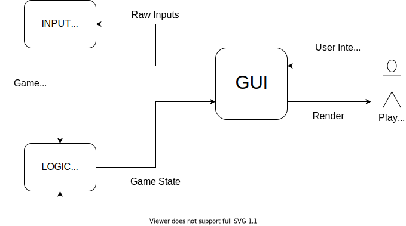

# Engine Design [DRAFT]

The engine will be a data-pipeline, with most pieces of the pipeline transforming some `GameState` data.

## Engine Cycles
1. The user interacts with the `GUI`, making inputs
2. The GUI pipes these raw inputs to the `Input` module
3. The `Input` module translates these raw inputs into game commands, that can be processed by the logic `Logic Core`
4. The `Logic Core` takes the `GameState` at current timestep t, and the commands from the `Input` module, and outputs the new state for the next timestep t+1. The new state then gets piped to the `GUI`, and back into the `Logic Core` for the next timestep computation.
5. The `GUI` recieves the new GameState and renders it to the screen.

## Modules
Here we will breakdown the functionality of each of the engine's modules, keeping in mind that any one module should not be concerned with any data or processing that another module encapsulates, to mantain modularity.

### GUI
#### Overview
The GUI is what the user sees and interacts with. It acts as both the start and end point of one engine cycle. Being a simple game, all user interactions with the GUI can be generalised to click-selection of menu components and on-screen information (in chronological order within a single turn):
1. Main menu navigation 
2. 'Roll Dice' confirmation
3. 'Buy Freedom / Get out of Jail' (can happen before roll)
4. 'Buy / Auction / Build' confirmation
5. 'Bid' with amount selection (in every increment e.g. +5, +50, +100)
6. 'Build Improvements' dialogue
7. 'Mortgage / Sell property' choice
8. 'Next Turn' confirmation

> Buying and bidding for properties can only happen after one complete cycle of the board.

As well as these turn-specific interactions, the player must be able to select their own properties for viewing, and any other player's current status (properties owned) for viewing. Since the player can do this at any time, rendering of the entire game view may need to happen on three separate layers, ordered by how urgently they require user input.:

- Layer 3: The topmost layer shows metagame renders like a pause menu and the winning or loss screen.
- Layer 2: Shows **active** game information such as buying and auctioning properties, building improvements and other dialogues
- Layer 1: Shows **passive** game information such as a more detailed view of another player's or a player's own properties.

These layers are rendered in ascending order, with each subsequent layer being rendered above the other.

Each interactable component in the GUI has a uniqe identifier that it uses when sending raw inputs to the input module. Take the example of rolling the die:
- The user is prompted to confirm their die roll
- They click on "Confirm" on the Roll Die menu
- The GUI component's click event is triggered and it sends a "CLICK, ID" message to the Input module, where ID is the component's identifier, in this case 'RollDie'.

> Since all user interactions in the engine prototype are clicks, the actual event type can be omitted, and the component need only send its ID to the Input module, which will assume a 'CLICK' event.

### Input
The job of the input module is to translate raw inputs from the GUI into commands understandable by the Logic Core. The language defining game commands consists of:

- ROLL
- BUY
- PASS
- BID [AMOUNT]
- MORTGAGE
- SELL
- BUY FREEDOM
- USE JAIL CARD
- DECLARE BANKRUPTCY

#### Polling
Since the GUI will fire off multiple events regardless of whether it makes sense in game, one job of the Input module is to filter redundant inputs and reduce overloading to the Logic Core. If the GUI were to call the engine directly, resultant behavior may be undesirable.

### Logic Core
The central unit of the entire engine. Receives game commands, the previous game state, and outputs the new game state.

## Game State
The core piece of data that each of our components relies on to perform their jobs correctly. The Game State consists of. Each reference to 'Player' is referring to the current ActivePlayer:

- Game Phase: { MAIN-MENU, PAUSE-MENU, PLAYER-MOVE, BUY-PROPERTY, AUCTION, PAY-RENT, PROPERTY-MANAGEMENT, END-GAME }:
	- MAIN-MENU: Menu for new game, player number, and game-mode selection
	- PAUSE-MENU: In-game menu with options to exit the game
	- PLAYER-MOVE: User confirmation -> Plays dice roll animation to get steps and moves player. During this phase if a player is in jail the die does not roll. Rather they are given the option to pay their bail or remain in jail.
	- BUY-PROPERTY: Player can choose to either buy the property they landed on or pass
	- AUCTION: Every player makes their bid. Highest bid wins
	- PAY-RENT: Player must pay the rent to player who owns landed tile. If unable to pay with current cash, players are offered options to mortage or sell their properties / improvements
	- PROPERTY-MANAGEMENT: Players can mortgage, sell, or improve their properties
	- END-GAME: Show end game winnning or losing end screen (and credits)

- Active Player: ID of active Player entity

- Players: Collection of Player entities in the game. A Player entity contains:
	- ID
	- Cash
	- Properties owned (by ID)
	- Special cards held
	- Position on board (either numeric or 'In Jail')

- Properties: Collection of Properties. Properties contain:
	- ID
	- Name
	- Buy Value
	- Rent Values (for each improvement)
	- Improvements built
	- Mortgage Status

- Special Cards: Two collections containing cards, for 'Opportunity Knocks' and 'Pot Luck' cards respectively
