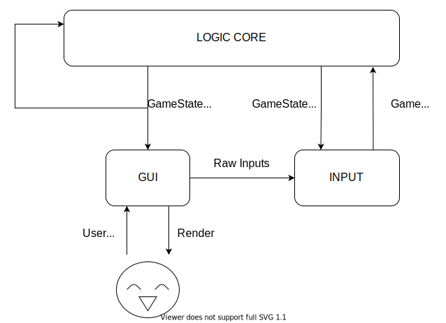

# Engine Design [DRAFT]

The engine will be a data-pipeline, with most pieces of the pipeline transforming some `GameState` data.

## Engine Cycles
1. The user interacts with the `GUI`, making inputs
2. The GUI pipes these raw inputs to the `Input` module
3. The `Input` module translates these raw inputs into game commands, that can be processed by the logic `Logic Core`
4. The `Logic Core` takes the `GameState` at current timestep t, and the commands from the `Input` module, and outputs the new state for the next timestep t+1. The new state then gets piped to the `GUI`, and back into the `Logic Core` for the next timestep computation.
5. The `GUI` recieves the new GameState and renders it to the screen.

## Modules
Here we will breakdown the functionality of each of the engine's modules, keeping in mind that any one module should not be concerned with any data or processing that another module encapsulates, to mantain modularity.

### GUI
#### Overview
The GUI is what the user sees and interacts with. It acts as both the start and end point of one engine cycle. Being a simple game, all user interactions with the GUI can be generalised to click-selection of menu components and on-screen information (in chronological order within a single turn):
1. Main menu navigation 
2. 'Roll Dice' confirmation
3. 'Buy Freedom / Get out of Jail' (can happen before roll)
4. 'Buy / Auction / Build' confirmation
5. 'Bid' with amount selection (in every increment e.g. +5, +50, +100)
6. 'Build Improvements' dialogue
7. 'Mortgage / Sell property' choice
8. 'Next Turn' confirmation

> Buying and bidding for properties can only happen after one complete cycle of the board.

As well as these turn-specific interactions, the player must be able to select their own properties for viewing, and any other player's current status (properties owned) for viewing. Since the player can do this at any time, rendering of the entire game view may need to happen on three separate layers, ordered by how urgently they require user input.:

- Layer 3: The topmost layer shows metagame renders like a pause menu and the winning or loss screen.
- Layer 2: Shows **active** game information such as buying and auctioning properties, building improvements and other dialogues
- Layer 1: Shows **passive** game information such as a more detailed view of another player's or a player's own properties.

These layers are rendered in ascending order, with each subsequent layer being rendered above the other.

### Input
[WIP]

### Logic Core
[WIP]

## Game State
[WIP]
